# メッシュタイルのxyz数値CSV出力プラグイン 利用マニュアル

## 起動

プラグインメニューから「メッシュタイル」をクリックします。
 
すると、下記のようなダイアログ画面が表示されます。

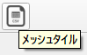

## ダイアログ画面詳細

対象レイヤー、レベル、および出力先フォルダなどを指定します。

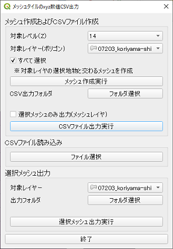

|    |    |
| ---- | ---- |
| ■メッシュ作成およびCSVファイル作成   |   |
| 対象レベル | メッシュタイルのズームレベルを指定します  |
| 対象レイヤー（ポリゴン） | メッシュタイルを表示するための地物があるポリゴンレイヤーを指定します  |
| すべて選択 | 対象レイヤのすべての地物をメッシュタイル作成対象にします  |
| メッシュ作成実行ボタン| 指定した内容でメッシュタイルを作成し、表示します  |
| フォルダ選択ボタン   | CSVファイルの出力先フォルダを選択します   |
| 選択メッシュのみ出力   | チェックした場合、選択したメッシュタイルのみを出力対象とします  |
| CSVファイル出力実行ボタン   | メッシュタイル情報がCSV形式で出力されます   |
| ■CSVファイル読み込み   |   |
| ファイル選択ボタン   | CSVファイルを読み込み、表示します  |
| ■選択メッシュ出力   |   |
| 対象レイヤー | CSV出力するメッシュレイヤーを指定します  |
| フォルダ選択ボタン | CSVファイルの出力先フォルダを選択します  |
| 選択メッシュ出力実行ボタン   | 選択したメッシュタイル情報がCSV形式で出力されます   |
| 終了   | ダイアログが閉じ、作成していたメモリレイヤも削除されます  |

## メッシュ作成およびCSVファイル作成

「対象レベル」「対象レイヤー（ポリゴン）」を選択し、「メッシュ作成実行ボタン」をクリックします。（領域やレベルによって処理時間が異なります） 
すると、下記のように、対象レイヤーの地物がある箇所に、対象レベルの大きさのメッシュが、名称「メッシュレイヤー」でメモリレイヤとして作成されます。

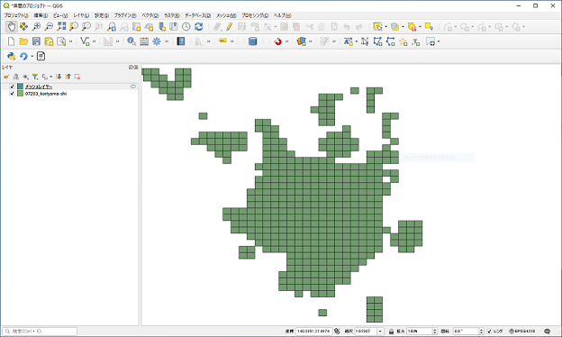

## CSV出力
上記メッシュレイヤ出力後、出力先フォルダを指定し、「CSVファイル出力実行ボタン」を押します。
 
すると、メッシュの座標(x,y,z)を数値としたCSVが出力されます。ファイル名は「xyz.csv」です。

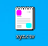

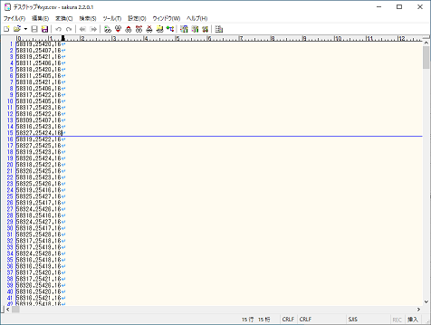

メッシュレイヤーがメモリレイヤから上記出力したCSVに変更されます。

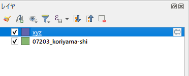

## CSVファイル読み込み

本プラグインを別途呼び出した場合など、上記出力したCSVファイルを読み込む場合に使用します。
 
CSVファイル読み込みの「ファイル選択ボタン」を選択し、CSVファイルを選択します。
 
すると、メッシュレイヤが作成され、メッシュタイルが表示されます。

## 選択メッシュ出力

選択ツールバーをクリックし、メッシュレイヤーの地物を選択（クリック）します。（複数選択する場合は、「Ctrl」キーを押したままクリックします。）

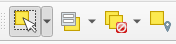

ダイアログから対象レイヤー（メッシュ）を選択し、続けて出力フォルダを指定します。

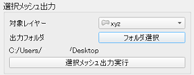

「選択メッシュ出力実行ボタン」をクリックします。すると、選択したメッシュタイルのCSVファイルが出力されます。
 ファイル名は「xyz.csv」で同一ファイルがある場合は上書きされます。

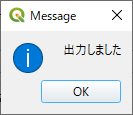

選択したメッシュタイルのレイヤーも別途作成されます。

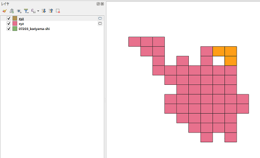

メッシュレイヤー以外（属性内容にx,y,zがないもの）を選択した場合、下記のようなエラーメッセージが表示されます。

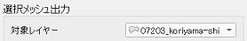

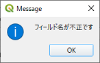

地物を選択していない場合、下記のようなエラーメッセージが表示されます。

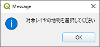

