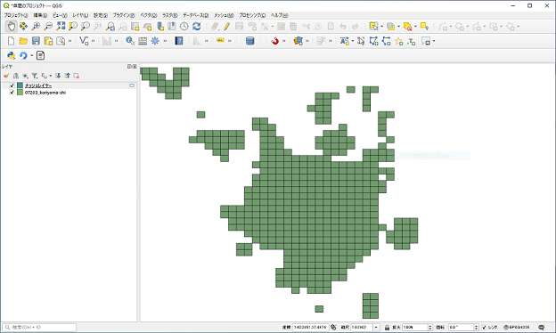

# メッシュタイルのxyz数値CSV出力プラグイン

タイルレイヤを識別するためのxyz値を、QGISで選択した地物が含まれる範囲で作成しCSVとして出力するQGISプラグインです。

## 概要

### ダイアログ画面

### メッシュ作成例

選択したポリゴンレイヤーに指定したズームレベルに該当する大きさのメッシュを作成します。

### CSV出力例

作成したメッシュの座標(x,y,z)を出力します。

## 利用方法

利用方法については、[使い方](./MANUAL.md)をご確認ください。

## ライセンス

本ツールは GNU GENERAL PUBLIC LICENSE v2 ライセンスが設定されています。[GNU GENERAL PUBLIC LICENSE Version 2, June 1991](https://www.gnu.org/licenses/old-licenses/gpl-2.0.txt)